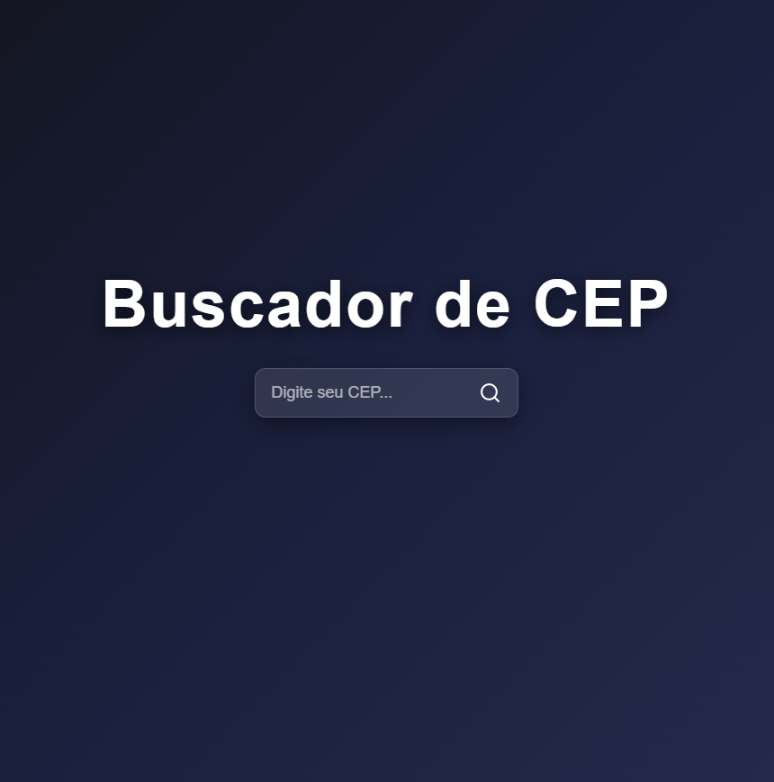

📍 Buscador de CEP

     
 
 Aplicação web para busca de endereços a partir de um CEP utilizando a API ViaCEP. 

🚀 Demonstração
 
<table align="center" width="800">
  <tr>
    <td width="50%" align="center">
      
    </td>
    <td width="50%" align="center">
      
    </td>
  </tr>
</table>

Projeto Front-End - Buscador de CEP  

---

 
Este projeto foi desenvolvido com foco na construção de uma aplicação web utilizando React, com o objetivo de consolidar conceitos fundamentais de consumo de API, manipulação de estado e renderização dinâmica de dados. 
 

---

Objetivos do Projeto 
Trabalhar com requisições HTTP utilizando API externa 
Utilizar React Hooks (useState e useEffect) 
Manipular e exibir dados dinâmicos na interface 
Criar uma interface simples, funcional e interativa 
Implementar validações básicas de entrada 

---

Tecnologias Utilizadas
 
React 
JavaScript (ES6+) 
Axios 
CSS3 
React Icons 
Conceitos Aplicados 

---

✔ Consumo de API com Axios 
✔ Gerenciamento de estado com useState 
✔ Efeitos colaterais com useEffect 
✔ Renderização condicional de componentes 
✔ Manipulação de eventos no React 
✔ Estruturação de código em módulos 

---

Resultado:
O projeto consiste em um buscador de CEP que permite: 
Inserir um CEP e consultar informações de endereço 
Exibir dados como rua, bairro, cidade e estado 
Mostrar informações adicionais como complemento (quando disponível) 
Apresentar os dados com uma leve animação na interface 

---

Autor Israel Duarte
